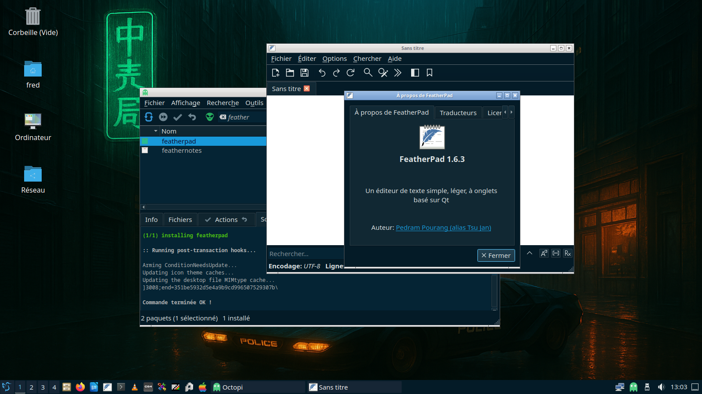
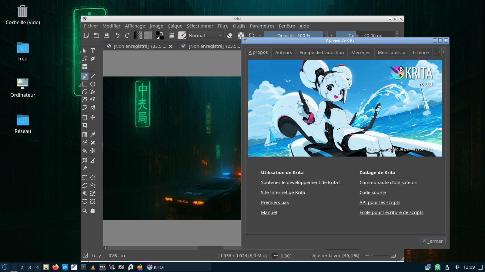

# FredoOS, les finitions !

Le plus long dans tout projet, ce sont les finitions. Voici donc quelques ajouts à faire pour rendre l’installation encore plus polyvalente et plus utilisable au quotidien.

Les finitions sont rajoutées chronologiquement, ce qui veut dire que ce document aura vocation à être modifié régulièrement.

Le premier paquet logiciel à rajouter, c’est le paquet linux-headers. En effet, si vous avez besoin d’installer un paquet comme un module noyau – ce à quoi j’ai été confronté récemment comme dans cet article de blog : [https://blog.fredericbezies-ep.fr/2026/09/03/ah-les-archlinuxeries/](https://blog.fredericbezies-ep.fr/2026/09/03/ah-les-archlinuxeries/) - il suffit de passer par Octopi et de rechercher le paquet linux-headers correspondant, à savoir :

- linux-headers pour le noyau linux court terme
- linux-lts-headers pour le noyau linux long terme
- linux-zen-headers pour le noyau linux zen

Autre outil que j’avais oublié d’installer dans le guide officiel, c’est un bloc note quand on a besoin de créer rapidement un fichier texte. J’ai donc choisi [Featherpad](https://github.com/tsujan/featherpad) que vous pourrez ajouter à votre installation.

Enfin, pour la retouche d’image et de photo, soit Gimp, soit Krita, ce dernier étant plus adapté aux environnements de bureau basé sur QT, comme LXQt.

