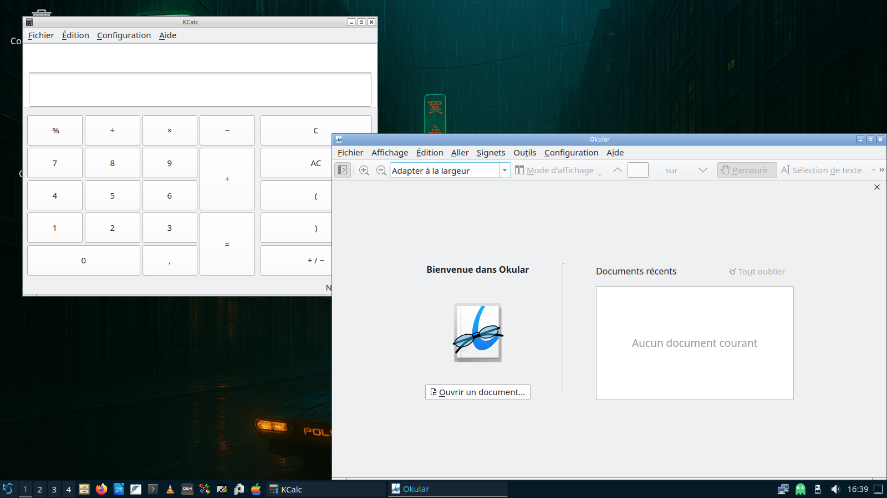
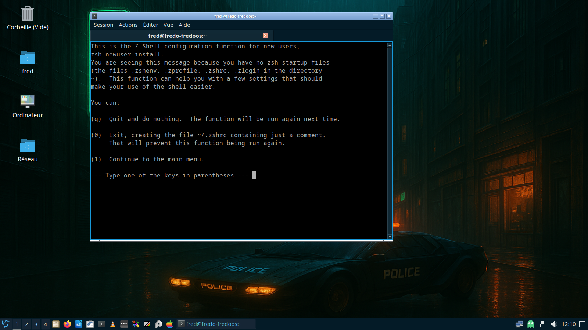
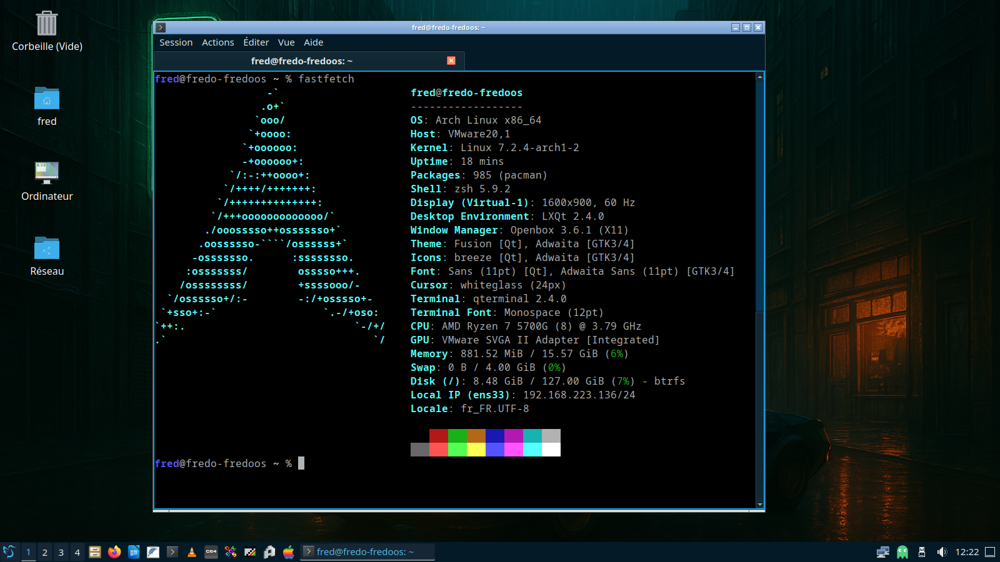
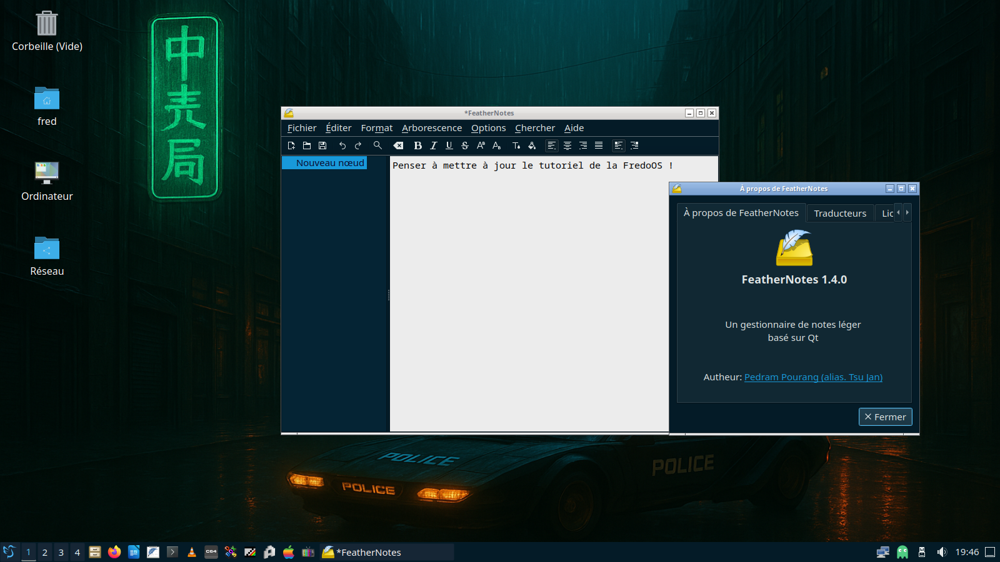

# FredoOS, les finitions !

Le plus long dans tout projet, ce sont les finitions. Voici donc quelques ajouts à faire pour rendre l’installation encore plus polyvalente et plus utilisable au quotidien.

Les finitions sont rajoutées chronologiquement, ce qui veut dire que ce document aura vocation à être modifié régulièrement.

## I) Les linux headers

Le premier paquet logiciel à rajouter, c’est le paquet linux-headers. En effet, si vous avez besoin d’installer un paquet comme un module noyau – ce à quoi j’ai été confronté récemment comme dans cet article de blog : [https://blog.fredericbezies-ep.fr/2026/09/03/ah-les-archlinuxeries/](https://blog.fredericbezies-ep.fr/2026/09/03/ah-les-archlinuxeries/) - il suffit de passer par Octopi et de rechercher le paquet linux-headers correspondant, à savoir :

- linux-headers pour le noyau linux court terme
- linux-lts-headers pour le noyau linux long terme
- linux-zen-headers pour le noyau linux zen

## II) Un bloc notes

Autre outil que j’avais oublié d’installer dans le guide officiel, c’est un bloc note quand on a besoin de créer rapidement un fichier texte. J’ai donc choisi [Featherpad](https://github.com/tsujan/featherpad) que vous pourrez ajouter à votre installation.


## III) La retouche photo

Pour la retouche d’image et de photo, soit Gimp, soit Krita, ce dernier étant plus adapté aux environnements de bureau basé sur QT, comme LXQt.


## IV) SDDM et son thème

Il y a un point moche, c'est le SDDM qui nous accueille et qui est moche. Par défaut, les thèmes elarun, maya et maldives sont installés. Personnellement, j'ai choisi le paquet AUR [archlinux-themes-sddm](https://aur.archlinux.org/packages/archlinux-themes-sddm) que je trouve minimaliste et sympa.

Une fois le thème installé via yay ou octopi, on commence par créer un répertoire puis un fichier de configuration qui va nous permettre de personnaliser SDDM. On passe par la ligne de commande, c'est plus rapide et plus simple.

```
sudo mkdir -p /etc/sddm.conf.d
sudo nano /etc/sddm.conf.d/sddm.conf
``` 

Et on entre les lignes suivantes :

```
[Theme]
Current=archlinux-soft-grey
```

Vous pouvez remplacer archlinux-soft-grey par elarun, maya ou maldives. Et voici le résultat avec archlinux-soft-grey :


## V) Complétons les outils bureautique.

Il manque quelques outils bien pratique, comme une calculatrice ou un visionneur de fichiers en PDF. Ici les outils de Plasma vont être mis à contribution.

- Skanlite (pour gérer les scanners)
- Kcalc
- Okular (pour visionner les fichiers en pdf)



## VI) Ajout de Zsh

Pour avoir le shell zsh dans le terminal, il faut commencer par installer trois paquets, à savoir `zsh`, `zsh-completions` et `gmrl-zsh-config`. Une fois les deux paquets installés, on ouvre un terminal et on commence par changer le shell avec la commande `chsh -s /usr/bin/zsh`. On entre ensuite la commande `zsh`.

On sélectionne l'option 0 pour sauvegarder le fichier de configuration de zsh. 



Ensuite, on modifie le fichier .zshrc pour avoir les lignes suivantes :

```
autoload -Uz compinit promptinit

prompt grml
```

Il faut ensuite se déconnecter et se reconnecter pour que zsh soit le shell par défaut. Vous aurez Zsh avec l'autocomplétion et surtout un shell plus évolué que ce bon vieux Bash. 



Une fois qu'on a gouté à la puissance de Zsh, on s'en sépare difficilement.

## VII) Ajout d'un outil "pense-bête"

En complément à FeatherPad, il existe un outil du nom de FeatherNotes qui joue le rôle de pense-bête pour LXQt. Il s'installe simplement avec un `sudo pacman -S feathernotes`.


