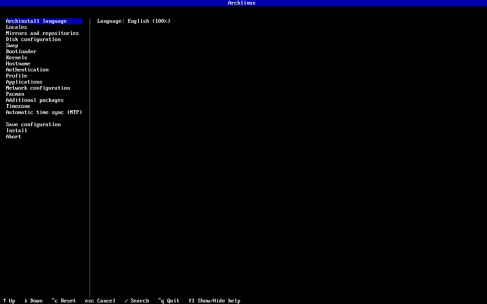
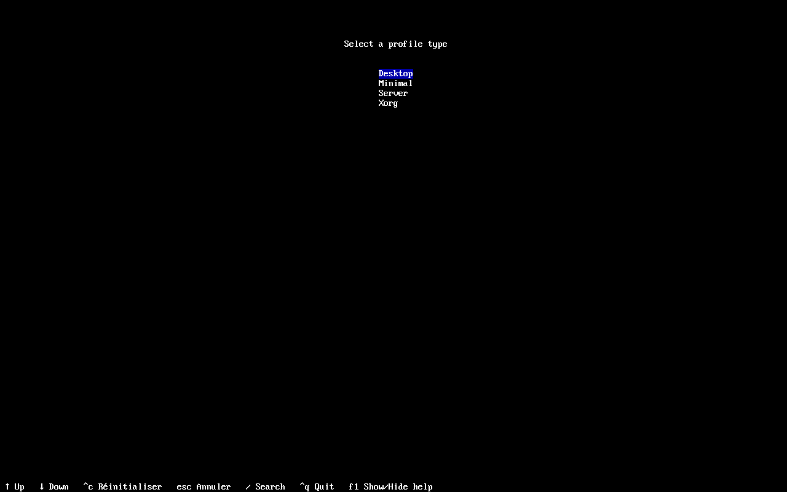
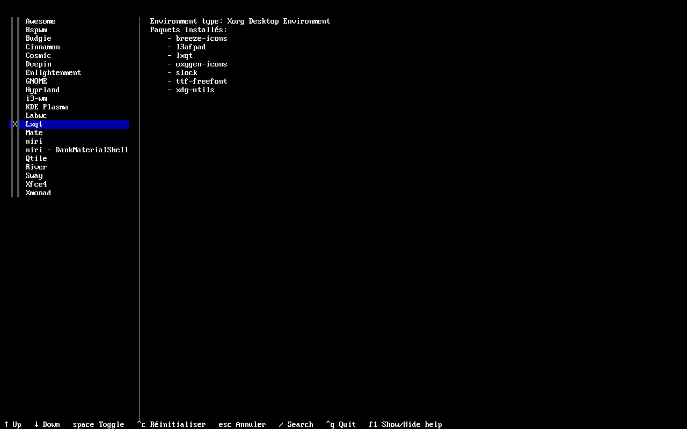
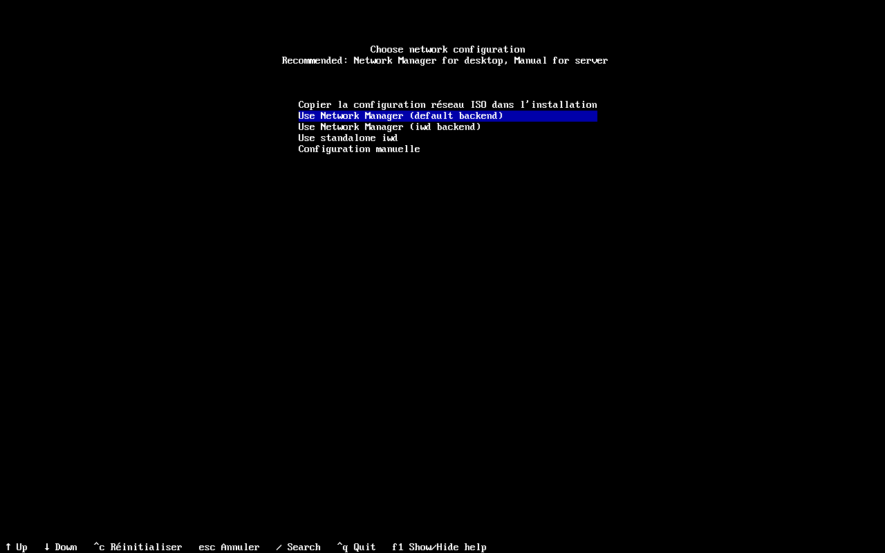
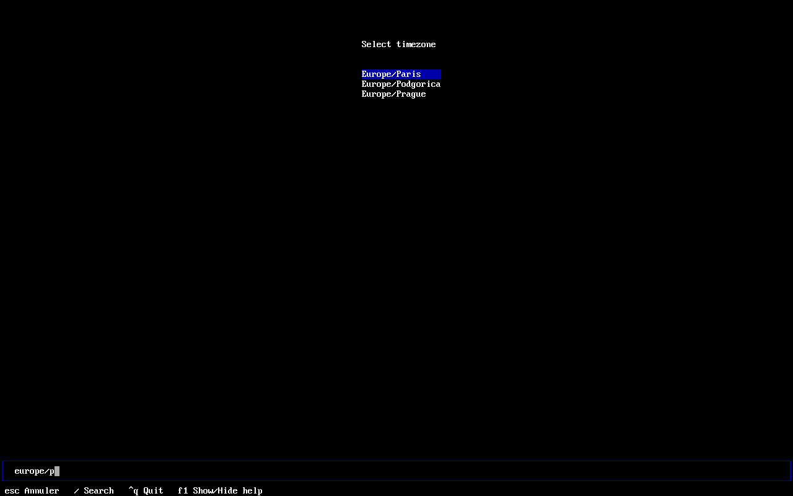
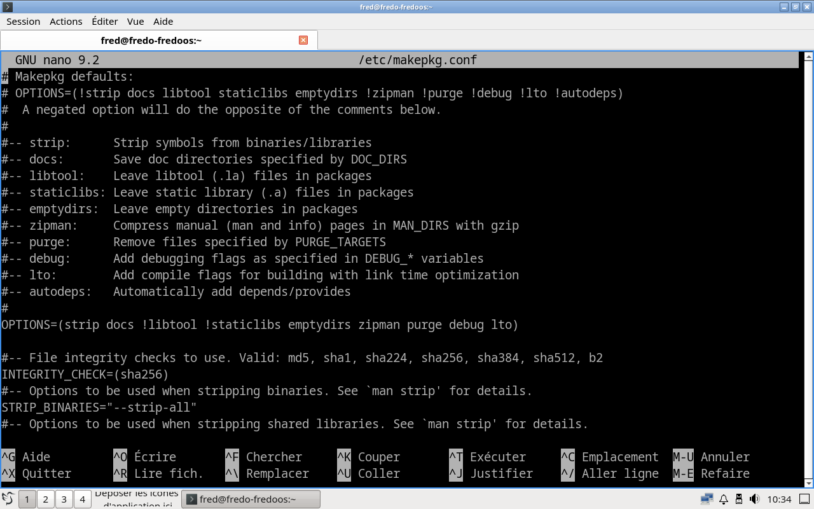
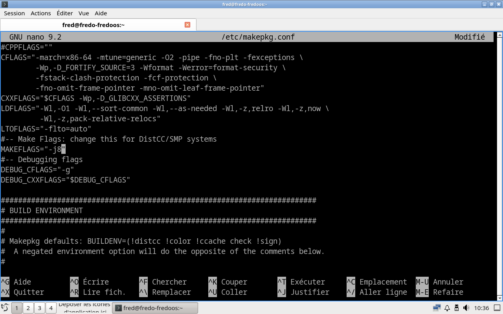
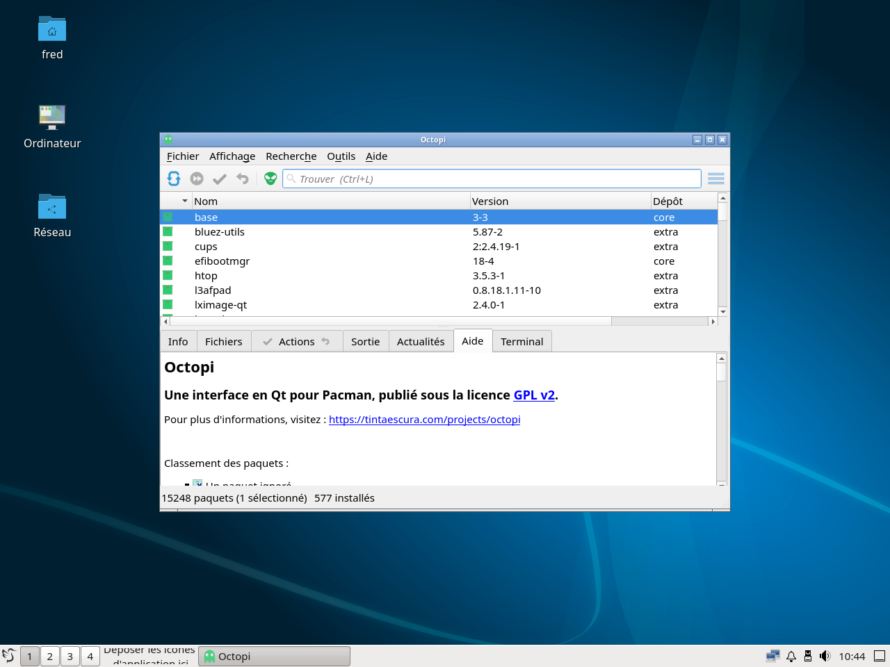
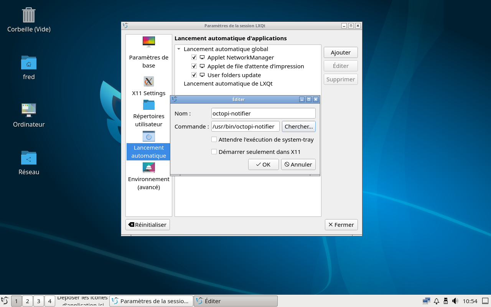
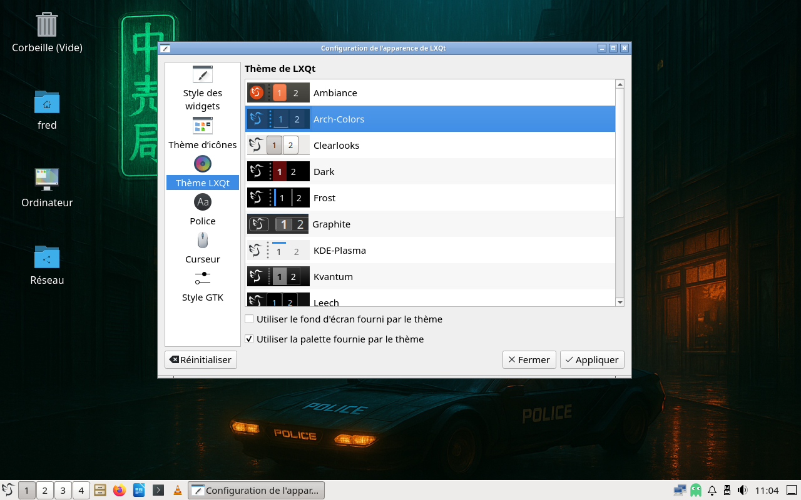

# Guide pour la FredoOS


Dans ce guide, je vais vous tenir la main pour créer chez vous ma DGFLI à moi, la FredoOS. C’est une base Archlinux avec LXQt, LibreOffice, Mozilla Firefox, VLC, Octopi (pour la gestion graphique des paquets logiciels). Je montre ici comment reproduire l’ensemble dans une machine virtuelle. Si vous voulez l’installer en dur, c’est à vos risques et périls, même si la FredoOS est la copie presque complète de l’installation faisant tourner mon PC portable.


## I) Installer la base.


Il faut commencer par récupérer sur le site d’Archlinux la dernière image ISO en date. Ensuite, on crée une machine virtuelle avec la moitié de la mémoire vive et la moitié des CPUs disponibles. Par exemple, pour mon Ryzen 7 5700G et 32 Go de mémoire, j’ai pris 16 Go de mémoire, 8 CPUs. Quant au disque cible, je vous conseille un minimum de 64 Go.


On démarre ensuite sur l’image ISO téléchargée. Lorsque archlinux est chargée, on tape deux commandes pour avoir le clavier français et charger l’installateur automatisé.

```
loadkeys fr
archinstall
```


On arrive devant cet écran quand Archinstall est démarré.





**Note :** Pour sélectionner une option, c’est la barre d’espace qui est utilisée. Pour avoir une recherche rapide pour les longues listes, c’est la touche / qui est utilisée.


On va dans "Archinstall Language" et on sélectionne french pour avoir l’ensemble traduit. On commence par les locales. Dans Paramètres régionaux, on choisit les valeurs suivantes pour chaque option  :


- Disposition du clavier : fr
- Langue locale : fr\_FR


Ensuite on va miroir et dépôts. On va dans Sélectionner des régions et on choisit France. Pour la configuration du disque, on reste avec les options par défaut, on appuie sur entrée à chaque fois. Il faut juste sélectionner le disque à «torturer » pour que le partitionnement automatique se mette en route.


Si vous voulez chiffrer votre installation, c’est le moment de le faire. Swap ? On passe. Chargeur de démarrage, je laisse les options par défaut. À vous de voir si vous voulez tout modifier ou pas. Noyaux ? Sélectionnez le ou les noyaux que vous voulez utiliser.


Nom d’hôte ? C’est juste pour donner un nom précis à l’ordinateur cible. Authentification ? On entre le mot de passe root et on crée un premier utilisateur. Je vous conseille de lui donner des droits administrateurs, comme cela vous pourrez utiliser sudo sans problème par la suite.


Dans le profil, on va sélectionner l’installation à faire. À savoir une installation minimale, avec un environnement de bureau – et les outils complémentaires qui vont bien comme le gestionnaire de connexion – bref, c’est l’étape la plus importante.


On va dans Profil / Type et on sélectionne Desktop.




Ensuite dans la liste, on sélectionne LXQt. Ce qui va nous permettre d’avoir une interface graphique dès le premier lancement.




Ensuite, on entre dans la section Application. J’ai choisi d’activer les options les unes après les autres, ce qui permet d’avoir du bluetooth, du son et le support basique des imprimantes, sans oublier un pare-feu basique au passage.


Dans Additional Fonts, on sélectionne toutes les polices, ça permettra d’avoir un jeu de polices déjà bien costaud dès le départ.


Dans Configurer le réseau, on choisit l’option "Use Network Manager (default backend)"




On ignore ensuite les options Pacman et Paquets supplémentaires pour choisir le fuseau horaire. Par exemple, Europe/Paris.




Maintenant, on peut aller sur installer et attendre patiemment que cette étape se termine. Une fois l’étape terminée, il faut aller dans le chroot pour deux petites commandes.


Il faut entrer chfn suivi du nom de l’utilisateur pour lui donner un nom complet plus parlant, dans mon cas, Tonton Fred. Étape qu’on peut sauter.


Pour la seconde, il faut installer les paquets git et base-devel qui nous sera bien pratique pour la suite du guide. Donc un `pacman -S git base-devel`.


Après, on tape exit pour quitter le chroot et reboot pour démarrer sur l’installation fraîchement terminée.


## II) Complétons notre instance de LXQt


Une fois redémarré, on arrive sur sddm et on se connecte dans LXQt. On va ouvrir un qterminal pour installer yay qui nous permettra d’installer qt-sudo et octopi sans se prendre la tête.


On tape dans le terminal la ligne suivante pour configurer les options de compilation de notre installation : `sudo nano /etc/makepkg.conf`. On va ensuite dans la section "OPTIONS" et on va mettre un ! Devant les options debug et lto.



Toujours dans ce fichier, on va dans l’option MAKEFLAGS et on saisit le nombre de CPUs utilisés, sans oublier de sortir le \# en début de ligne. On enregistre ensuite le fichier avec le raccourci clavier CTRL+X.



On tape dans le terminal la ligne suivante : `git clone` [https://aur.archlinux.org/yay.git](https://aur.archlinux.org/yay.git)

On continue avec un `cd yay`. Puis avec un `makepkg -sri` pour installer yay.

Enfin, une fois yay installé, on peut passer à l’installation d’octopi : `yay -S qt-sudo` puis `yay -S octopi`. Maintenant, on peut lancer Octopi pour installer les paquets manquants.



Maintenant, voici la liste des paquets à installer avec Octopi :


- libreoffice-fresh-fr
- firefox-i18n-fr
- vlc et vlc-plugins-all
- gvfs et ses greffons
- fastfetch
- 7zip
- zip
- unzip
- less
- mc


Une fois les logiciels installés, il faut se déconnecter et se reconnecter. Ce qui permet d’activer gvfs et d’avoir la corbeille sur le fond d’écran et la gestion des périphériques amovibles fonctionnelle.


## III) Les finitions.


Maintenant que notre LXQt est fonctionnel, on va s’attaquer au plus ennuyeux, les finitions. On va commencer par rajouter l’icone d’Octopi dans la zone de notification. Il faut ouvrir le menu LXQt, aller dans Paramètres de LXQt / Paramétreur de session LXQt.


Dans la nouvelle fenêtre, on va sur Lancement automatique / ajouter et on remplit ainsi :


- Nom : octopi-notifier
- Commande : /usr/bin/octopi-notifier



Ensuite on clique sur OK. Ensuite, après un duo déconnexion et reconnexion, l’icone d’octopi est disponible en bas à droite de l’écran.


On rajoute dans la zone « déposer les icones... » les logiciels dans l’ordre suivant :


- PCManFM-Qt
- Mozilla Firefox
- LibreOffice Writer
- Qterminal
- VLC


On finit avec l’apparence générale. Si vous voulez mon fond d’écran blade runner, il est téléchargeable soit :


Sur mediafire : [https://www.mediafire.com/file/am8s3by4bv2ema6/BladeRunner.png/file](https://www.mediafire.com/file/am8s3by4bv2ema6/BladeRunner.png/file)

Sur Google Drive : [https://drive.google.com/file/d/1ljJt8YEoyjUA\_cBtxqko1SOPYVa7x3N5/view?usp=drive\_link](https://drive.google.com/file/d/1ljJt8YEoyjUA_cBtxqko1SOPYVa7x3N5/view?usp=drive_link)


Enfin, on modifie le thème en allant dans Paramètres de LXQt / Apparence / Thème LXQt/Arch-Colors.



Et voila, la FredoOS est désormais complètement reproduite. Je n’ai pas parlé des logiciels qu’on peut épingler comme Favoris, car c’est en fonction de vos goûts. Et avec seulement 3 paquets AUR par défaut, on peut être tranquille durant pas mal de temps:)


Sur ce, bonne fin de journée.
